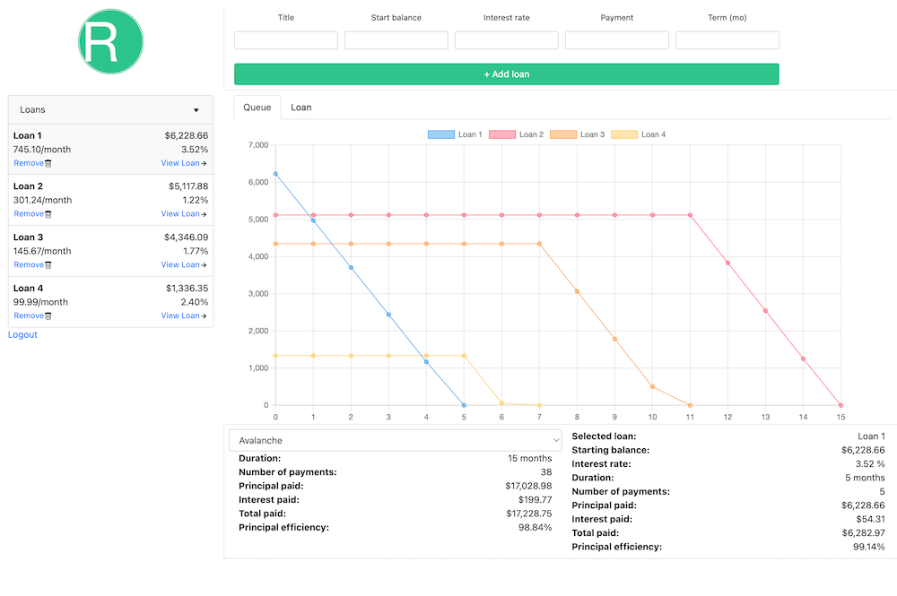
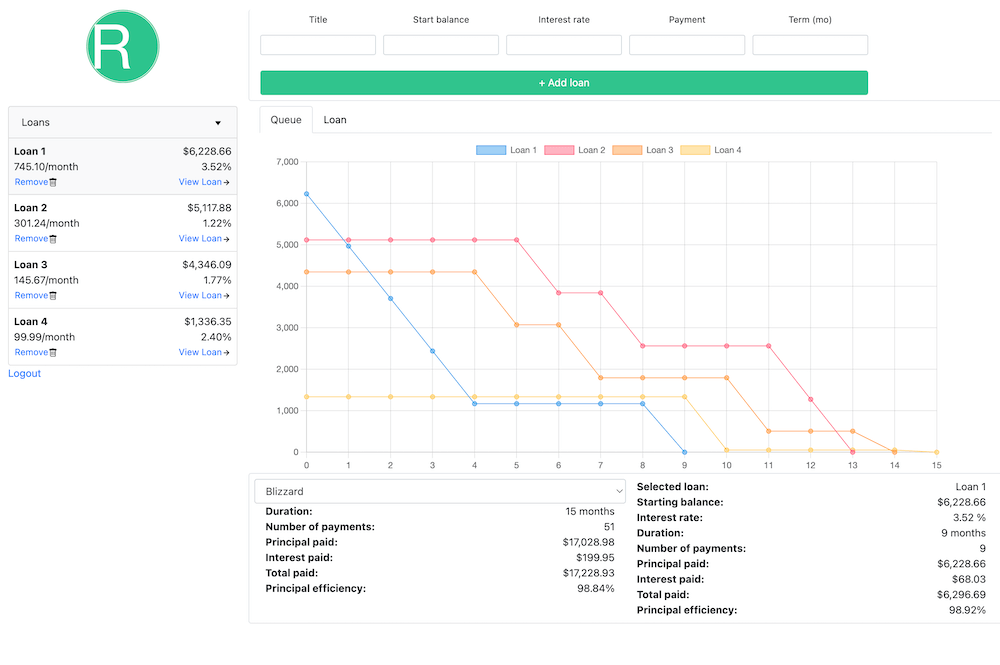
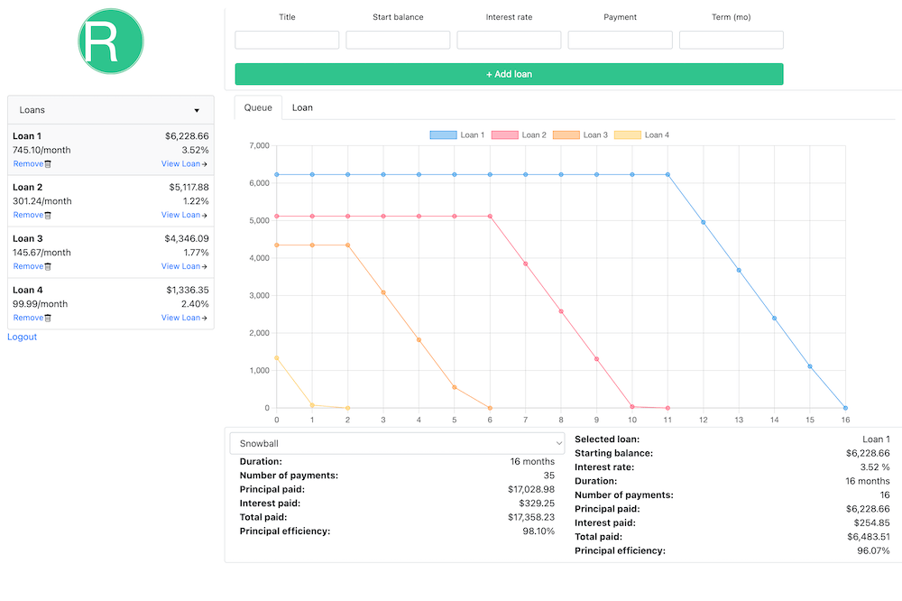
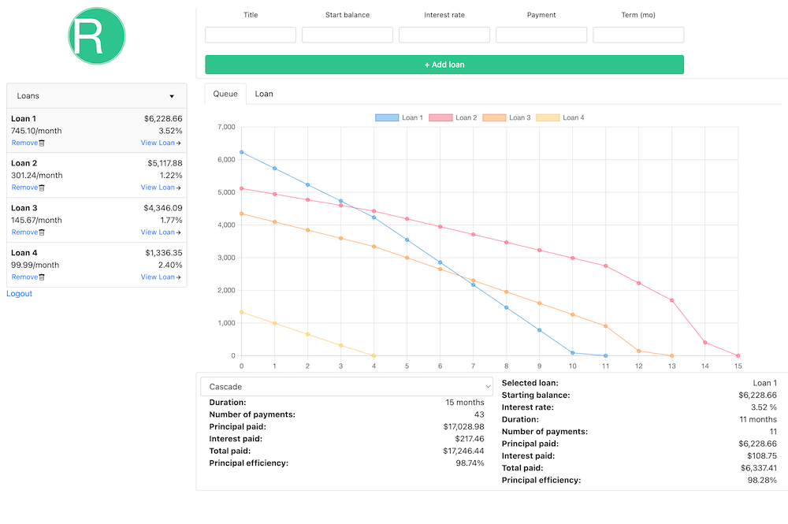

# FinanceTools

Tools for modelling loan amortization schedules, playing out hypothetical payment scenarios, and comparing repayment strategies across multiple loans.

## Getting started

Requires [Python 3.9](https://www.python.org/downloads/release/python-390/)+

```sh
# Install the package from GitHub
pip install git+https://github.com/TurbulentRice/financetools.git
```

```py
# Import the classes in your code
from financetools import Loan, LoanQueue, LoanQueueCompare
```

See [example.py](example.py) for a demo of basic methods and capabilities.

```py
python example.py
```

## Testing

Using unittest standard library.

```py
python -m unittest discover tests
```

# Loan Repayment Algorithms Overview

Images are from [RepayMint](https://github.com/TurbulentRice/RepayMint), the Preact front-end I am building around this library.

## Ordered Algorithms
Ordered algorithms are focused on targeting a single loan each pay cycle, paying only minimums on all except the target loan, paying one off at a time.

### Avalanche
Orders loans by interest rate and balance. Payments target the loan with the highest interest rate and balance until all loans are paid off.

This algorithm consistently results in the lowest interest paid
over the course of large loans.



### Blizzard
Orders loans by monthly interest cost. Payments target the loan with the largest monthly interest cost until all loans are paid off. The targeted loan can change with every payment when multiple loans are equally "expensive." This accounts for the tooth-like pattern in loan payment histories.

This algorithm is similar to Avalanche, providing some benefits for small loans and/or large budgets.



### Snowball
Orders loans by balance. Payments target the loan with the lowest starting balance until all loans are paid off.

This algorithm is largely motivaitonal, quickly reducing the number of outstanding loans, but is not necessarily cost-effective.



## Unordered Algorithms
Unordered algorithms distribute payments strategically, according to need, and result in steady payment histories. These methods can reduce short-terms monthly costs of loans.

### Cascade
Distributes a percentage of a monthly budget to each loan each pay cycle, proportional to the loan's percentage contribution to the total (sum) interest rate of all loans.



### Ice Slide
Distributes a percentage of a monthly budget to each loan each pay cycle, proportional to the loan's percentage contribution to the total (sum) monthly cost (minimum payments) of all loans.


